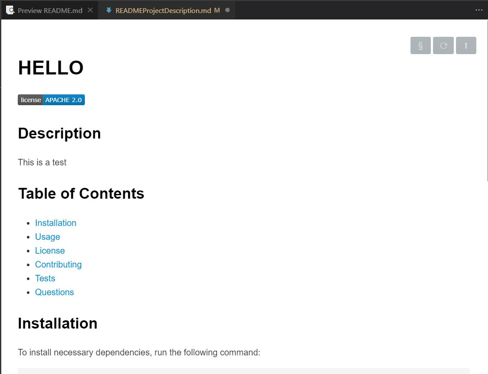

# README Generator

## Purpose

A command-line application that dynamically generates a professional README.md file from a user's input.

## Built With

- Markdown
- Node.js
- Inquirer package
- fs

## Website

Link to walk-through video:
https://drive.google.com/file/d/1AfGl6wkxPy9a5S-RTf0lnQZuc9VGVyeE/view?usp=sharing

## Contribution

Made by Archita
